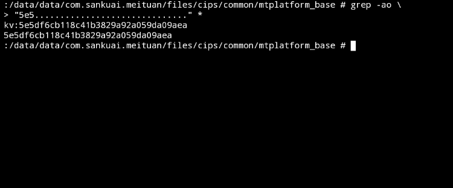

Meituan
============

Meituan is a shopping app from China, that has many different functionalities
including entertainment, restaurant reviews, travel, shopping, and other goods
and services.

We analyzed version 11.19.209 for Android from APKPure.  We found that Meituan
sends unique device-specific identifiers and GPS information over the Internet
in plaintext in ways that have implications for VPN users.


App description
------------

Meituan has many different functionalities and is, in some sense, multiple apps
and APIs merged into one.  Meituan merged with Dianping and acquired other
apps/companies, and Meituan and Dianping both incoporate these and appear to
offer similar functionalities (e.g., Mobike for bike-sharing).  GPS is key to
many of these functionalities.  I.e., without location services enabled the
functionalities of the app are greatly reduced.

Meituan has [691 million paying
users](https://www.chinainternetwatch.com/31107/meituan-quarterly/), which is
more than 13% of [the world's Internet
users](https://datareportal.com/global-digital-overview) and two thirds of [the
population of Internet users in China](https://www.statista.com/statistics/265140/number-of-internet-users-in-china/).
Some functionalities of Meituan and Dianping are specific to China, but others
work in other locations where Chinese speakers use the Internet, such as the
United States where users can find restaurants, entertainment, national parks,
etc., see reviews for for these locations, get directions, etc.  There are no
other language options for Meituan besides Chinese.

Unencrypted PII (Personally Identifiable Information) and GPS information
------------

We found that, upon installation,  Meituan and Dianping create a device-specific
ID that they share, which is sent in plaintext to various servers at various
times and is sometimes accompanied by GPS information.

A PCAP showing this behavior is [here.](meituan.pcap)  It can be processed with
[this Python script](meituan.py).  Note that the script is using only regular
expressions, deep packet inspection of Internet traffic for Meituan is possible
in this simple manner because there are no encodings or encryption.  Per-packet
analysis is probably possible to optimize for performance (e.g., to track
hundreds of millions of users), but we use per-flow analysis here for
simplicity.   Here is the Linux command for using the script on the PCAP:

```bash
tcpflow -c -r meituan.pcap -X /dev/null | ./meituan.py
```
On Debian-based distributions, tcpflow can be installed with `sudo apt install
tcpflow`.  If a Linux machine is set up as a WiFi hotspot for an Android phone,
the following command can be used in real time to monitor when PII and GPS
information is sent by Mtituan in plaintext. 

```bash
sudo tcpflow -c -i <<your_interface_here>> -X /dev/null | ./meituan.py
```

Output from the script for the above PCAP is here:

~~~
101.236.13.9:443...
5E5DF6CB118C41B3829A92A059DA09AE
43.132.13.85:80...
5E5DF6CB118C41B3829A92A059DA09AE
43.132.13.85:80...
5E5DF6CB118C41B3829A92A059DA09AE
103.37.154.66:443...
5E5DF6CB118C41B3829A92A059DA09AE
101.236.12.8:80...
5E5DF6CB118C41B3829A92A059DA09AE
101.236.12.8:80...
5E5DF6CB118C41B3829A92A059DA09AE
101.236.12.8:80...
5E5DF6CB118C41B3829A92A059DA09AE
101.236.12.8:80...
5E5DF6CB118C41B3829A92A059DA09AE
43.132.13.85:80...
5E5DF6CB118C41B3829A92A059DA09AE
101.236.13.9:443...
5E5DF6CB118C41B3829A92A059DA09AE
119.28.229.25:443...
5E5DF6CB118C41B3829A92A059DA09AE
119.29.126.219:443...
5E5DF6CB118C41B3829A92A059DA09AE
103.37.154.66:443...
5E5DF6CB118C41B3829A92A059DA09AE
119.29.126.219:443...
5E5DF6CB118C41B3829A92A059DA09AE
119.29.126.219:443...
5E5DF6CB118C41B3829A92A059DA09AE
43.132.13.85:80...
5E5DF6CB118C41B3829A92A059DA09AE
43.132.13.85:80...
5E5DF6CB118C41B3829A92A059DA09AE
43.132.13.85:80...
5E5DF6CB118C41B3829A92A059DA09AE
119.28.229.25:443...
5E5DF6CB118C41B3829A92A059DA09AE
103.37.142.163:80...
5E5DF6CB118C41B3829A92A059DA09AE
103.37.142.163:80...
5E5DF6CB118C41B3829A92A059DA09AE
43.132.13.85:80...
5E5DF6CB118C41B3829A92A059DA09AE lat=33.43939279,lng=-111.67625259
43.132.13.85:80...
5E5DF6CB118C41B3829A92A059DA09AE
162.62.80.176:80...
5E5DF6CB118C41B3829A92A059DA09AE
162.62.80.176:80...
5E5DF6CB118C41B3829A92A059DA09AE
43.132.13.85:80...
5E5DF6CB118C41B3829A92A059DA09AE
43.132.13.85:80...
5E5DF6CB118C41B3829A92A059DA09AE
43.132.13.85:80...
5E5DF6CB118C41B3829A92A059DA09AE lat=33.43939279,lng=-111.67625259
43.132.13.85:80...
5E5DF6CB118C41B3829A92A059DA09AE
103.37.142.163:80...
5E5DF6CB118C41B3829A92A059DA09AE
103.37.142.163:80...
5E5DF6CB118C41B3829A92A059DA09AE
203.76.217.195:443...
5E5DF6CB118C41B3829A92A059DA09AE
103.202.146.43:443...
5E5DF6CB118C41B3829A92A059DA09AE
162.62.80.176:80...
5E5DF6CB118C41B3829A92A059DA09AE
162.62.80.176:80...
5E5DF6CB118C41B3829A92A059DA09AE
162.62.80.176:80...
5E5DF6CB118C41B3829A92A059DA09AE
162.62.80.176:80...
5E5DF6CB118C41B3829A92A059DA09AE
162.62.80.176:80...
5E5DF6CB118C41B3829A92A059DA09AE
162.62.80.176:80...
5E5DF6CB118C41B3829A92A059DA09AE
101.236.12.8:80...
5E5DF6CB118C41B3829A92A059DA09AE
101.236.12.8:80...
5E5DF6CB118C41B3829A92A059DA09AE
162.62.80.176:80...
5E5DF6CB118C41B3829A92A059DA09AE
162.62.80.176:80...
5E5DF6CB118C41B3829A92A059DA09AE
43.132.13.85:80...
5E5DF6CB118C41B3829A92A059DA09AE lat=33.43939279,lng=-111.67625259
43.132.13.85:80...
5E5DF6CB118C41B3829A92A059DA09AE
162.62.80.176:80...
5E5DF6CB118C41B3829A92A059DA09AE
162.62.80.176:80...
5E5DF6CB118C41B3829A92A059DA09AE
162.62.80.176:80...
5E5DF6CB118C41B3829A92A059DA09AE
162.62.80.176:80...
5E5DF6CB118C41B3829A92A059DA09AE
162.62.80.176:80...
5E5DF6CB118C41B3829A92A059DA09AE
162.62.80.176:80...
5E5DF6CB118C41B3829A92A059DA09AE
119.29.126.219:443...
5E5DF6CB118C41B3829A92A059DA09AE
162.62.80.176:80...
5E5DF6CB118C41B3829A92A059DA09AE
162.62.80.176:80...
5E5DF6CB118C41B3829A92A059DA09AE
162.62.80.176:80...
5E5DF6CB118C41B3829A92A059DA09AE
~~~

Note that the device specific ID (`5E5DF6CB118C41B3829A92A059DA09AE`) is
sometimes accompanied by GPS location information.  Also note that the user's
Internet routable IP address is in the header of every packet sent, so can be
linked to this ID regardless of if it is otherwise collected and sent in plaintext.

The device-specific ID was generated upon installation of Dianping, but is
stored locally by Meituan and possibly is shared with, and used by, other apps:



At the time this PCAP was created, the IP addresses that PII and GPS information
were sent to were in the following locations:

| Server IP and port | Information sent | Location |
| ------------------ | ---------------- | -------- |
| 101.236.12.8:80 | PII | Beijing, China |
| 101.236.13.9:443 | PII | Beijing, China |
| 103.202.146.43:443 | PII | Beijing, China |
| 103.37.142.163:80 | PII | Beijing, China |
| 103.37.154.66:443 | PII | Beijing, China |
| 119.28.229.25:443 | PII | Hong Kong |
| 119.29.126.219:443 | PII | Hong Kong |
| 162.62.80.176:80 | PII | Hong Kong |
| 203.76.217.195:443 | PII | Beijing, China |
| 43.132.13.85:80 | PII and GPS | Singapore |

Although the destination port is sometimes 443, for the traffic we identified
with unencrypted PII there is no TLS encryption or other form of encryption,
regardless if it is on port 80 or 443.

The Dianping application appears to have been compiled into the Meituan app,
and vice versa.   PII and GPS information being sent in plaintext appears in
different forms sent to different servers, and appears to come from both
Dianping and Meituan code bases.  E.g., here is GPS information being sent by
the Dianping code base compiled into Meituan (decompiled with JADX):

~~~java
package com.dianping.apimodel;

import android.net.Uri;
import com.dianping.dataservice.mapi.b;
import com.dianping.dataservice.mapi.c;
import com.dianping.dataservice.mapi.e;
import com.dianping.model.MTOVChannelTopBannerModule;
import com.tencent.connect.common.Constants;

/* loaded from: classes.dex */
public final class ae {
    public Integer a;
    public Double b;
    public Double c;
    public Integer d;
    public c e = c.NORMAL;
    private final String f = "http://mapi.dianping.com/mapi/mtoverseasindex/mtcommonbanner.overseas";
    private final Integer g = 1;

    public final e<MTOVChannelTopBannerModule> a() {
        Uri.Builder buildUpon = Uri.parse("http://mapi.dianping.com/mapi/mtoverseasindex/mtcommonbanner.overseas").buildUpon();
        Integer num = this.a;
        if (num != null) {
            buildUpon.appendQueryParameter("viewcityid", num.toString());
        }
        Double d = this.b;
        if (d != null) {
            buildUpon.appendQueryParameter("lng", d.toString());
        }
        Double d2 = this.c;
        if (d2 != null) {
            buildUpon.appendQueryParameter("lat", d2.toString());
        }
        Integer num2 = this.d;
        if (num2 != null) {
            buildUpon.appendQueryParameter("locatecityid", num2.toString());
        }
        b bVar = new b(buildUpon.build().toString(), Constants.HTTP_GET, null, this.e, false, null, 0L, MTOVChannelTopBannerModule.d);
        bVar.i = true;
        return bVar;
    }
}
~~~

And here is GPS information being sent by Meituan itself in the Meituan app:

~~~java
package com.meituan.android.food.homepage.hotsearch;

import android.os.Bundle;
import android.support.v4.content.h;
import android.text.TextUtils;
import com.meituan.android.base.BaseConfig;
import com.meituan.android.food.homepage.i;
import com.meituan.android.food.homepage.sidebar.FoodSidebar;
import com.meituan.android.food.mvp.f;
import com.meituan.android.food.poilist.FoodQuery;
import com.meituan.android.food.retrofit.FoodApiRetrofit;
import com.meituan.retrofit2.androidadapter.b;
import com.sankuai.meituan.retrofit2.Call;
import com.sankuai.model.AccountProvider;
import java.util.HashMap;
import java.util.Map;

/* loaded from: classes4.dex */
public final class a extends com.meituan.android.food.mvp.a<FoodSidebar> {
    FoodQuery a;

    public a(f fVar, int i, FoodQuery foodQuery) {
        super(fVar, i);
        this.a = foodQuery;
    }

    @Override // com.meituan.android.food.mvp.d
    public final void a() {
        g().b(d(), null, new b<FoodHotSearch>(f()) { // from class: com.meituan.android.food.homepage.hotsearch.a.1
            @Override // com.meituan.retrofit2.androidadapter.b
            public final /* bridge */ /* synthetic */ void a(h hVar, FoodHotSearch foodHotSearch) {
                a.this.b(foodHotSearch);
            }

            @Override // com.meituan.retrofit2.androidadapter.b
            public final Call<FoodHotSearch> a(int i, Bundle bundle) {
                AccountProvider a = com.meituan.android.singleton.a.a();
                FoodApiRetrofit a2 = FoodApiRetrofit.a(a.this.e());
                long j = a.this.a.cityId;
                String str = a.this.a.latlng;
                long a3 = a.a();
                String str2 = BaseConfig.uuid;
                Map<String, String> b = i.b();
                HashMap hashMap = new HashMap();
                if (str != null) {
                    hashMap.put("mypos", str);
                }
                hashMap.put("userid", String.valueOf(a3));
                hashMap.put("uuid", str2);
                if (b == null || b.isEmpty()) {
                    a2.c(hashMap);
                } else {
                    hashMap.putAll(b);
                }
                if (!TextUtils.isEmpty(a2.a)) {
                    hashMap.put("selectPos", a2.a);
                    hashMap.put("useSelectPos", Boolean.toString(true));
                }
                return a2.m().getFoodHotSearchWords(j, hashMap);
            }

            @Override // com.meituan.retrofit2.androidadapter.b
            public final void a(h hVar, Throwable th) {
                roboguice.util.a.c(th);
            }
        });
    }
}
~~~

This is an example of why the device-specific ID, GPS information, and other
PII is sent in different formats, with different APIs, to several different
servers.

Device-specific ID is also used for Dianping
------------

We found that the same device-specific ID is used by Dianping, which could be
used to link users across these two apps, and other apps, and link the user to
other information that Dianping collects and transmits in plaintext such as the
user's WiFi MAC address.

A PCAP showing this behavior for Dianping version 10.26.32 for Android is
[here.](dianping.pcap)  The first packet showing this behavior can be
highlighted in this way: 

```bash
tcpflow -c -r dianping.pcap -X /dev/null | grep unionId | head -n1 | sed "s/,/,\n/g"
```

Output of this command for the above PCAP is here:

~~~
{"appInfo":{"app":"com.dianping.v1",
"version":"10.26.32",
"appName":"dianping_nova",
"sdkVersion":"1.15.3.4",
"userId":"",
"downloadSource":"androidmarket"},
"idInfo":{"localId":"086d031a883c1d36fba736f305ad3a5409396e8021ecaace68",
"unionId":"5e5df6cb118c41b3829a92a059da09aea165640984736654673",
"uuid":"00000000000005E5DF6CB118C41B3829A92A059DA09AEA165640984736654673",
"dpid":"5e5df6cb118c41b3829a92a059da09aea165640984736654673",
"requiredId":"2"},
"environmentInfo":{"platform":"android",
"osName":"QPWS30.61-21-18-7-10",
"osVersion":"10",
"clientType":"7"},
"deviceInfo":{"keyDeviceInfo":{"imei1":"000000000000000",
"imei2":"000000000000000",
"androidId":"249742e293ea6072",
"appid":{"share":"motorolamotog(7)plus$7186e7efa221a5ba",
"local":{"oldid":"motorolamotog(7)plus$7186e7efa221a5ba",
"newid":""}}},
"secondaryDeviceInfo":{"serialNumber":"unknown",
"bluetoothMac":"02:00:00:00:00:00",
"wifiMac":"d2:4c:cf:57:fe:a7",
"simulateId":"1C0D53AF090458C",
"uuid":"ce29a1b9-4780-410b-ba0f-f0f7dac1dd4c"},
"brandInfo":{"brand":"motorola",
"deviceModel":"moto g(7) plus"}},
"communicationInfo":{"jntj":"",
"jddje":"",
"nop":"unknown"}}
~~~

The identifier used for `unionId` is derived from the identifier used by
Meituan on the same device. 

Note that the WiFi MAC is randomized by modern versions of Android every time
the user connects to a new network.  However, it is still an identifier that
can, within this time period, be used to link users across different apps.

Implications for VPN users and users of other circumvention tools
------------

We use "VPN" to refer broadly to a range of VPN-like technologies.  Any
circumvention tool that captures outgoing traffic from applications without
requiring that they be configured with a proxy, and then causes that traffic or
connection to exit a tunnel onto the Internet from a remote IP is VPN-like and
we refer to it here as a VPN.  I.e., anything that would proxy the
above-highlighted Meituan traffic is a VPN for the purposes of this discussion.

Sending PII and GPS information in plaintext, or with easily decryptable
encryption, is a common problem that is not specific to Meituan and Dianping.
Internet Service Providers (ISPs) could use this information from apps such as
this to readily enumerate VPN users independently of the VPN they use, the VPN
protocol, the effectiveness of any pluggable transports, the strength of the
VPN's encryption, or any other factors that would otherwise make the use of a
VPN undetectable.

To achieve this, the ISP would need some visibility into traffic both when the
user is using the VPN and when they are not.  The majority of Meituan users are
located in China and, if they use a VPN, are likely to use VPNs outside of
China, so we focus on these users and that specific VPN use case in the
following example.  Suppose an ISP can see traffic that exits or enters China.
When a user uses Meituan inside China without a VPN, the ISP can easily link a
user's device-specific ID, GPS coordinates, and Internet routable IP address
based on deep packet inspection of traffic sent to a server in Singapore
(43.132.13.85:80).  If the user then connects to a VPN and again uses Meituan,
the overseas Internet routable IP address they use to exit the VPN tunnel can be
linked to the user's device-specific ID based on traffic sent to servers in
Beijing (101.236.12.8:80, 101.236.13.9:443, 103.202.146.43:443,
103.37.142.163:80, 103.37.154.66:443, and 203.76.217.195:443).  This can, in
turn, be linked to their GPS coordinates, routable Internet IP address before
they connected to a VPN, and any other PII or device information that might help
the ISP identify the user.  Because this information can be acted upon in
real-time or used in combination with network flow information or other historic
data relating to the same IP addresses, Meituan's poor transport layer security
has many different implications for the anonymity and availability of VPN users
who use this app.

Possible mitigations
------------

Users could either cease to use Meituan, or use it only with a VPN or only
without a VPN.  However, PII is transmitted with poor transport security by many
apps, and different types of PII can be linked across apps for the same user
and/or device.  A user would, in practice, require a total partition between
different pieces of PII, using some apps only without a VPN and some apps only
with a VPN, and with assurance (based on reverse engineering) that the two sets
of apps cannot be linked.  This is not likely to be an effective mitigation
against the broader issue of poor transport layer security putting VPN users at
risk.

Meituan and other apps that send PII and GPS information could improve their
transport security to be in compliance with cryptography best practices.  This
could be achieved easily by applying TLS encryption, for example.  In this case
any ISP that wished to enumerate VPN users based on the PII and GPS information
collected by apps would need to collude with the vendors of these apps.

Short of gaining an understanding of the PII and GPS information collected by
any apps a VPN user might use, via reverse engineering or automated analysis,
and making discerning decisions by IP address or in the application layer about
whether to proxy/tunnel certain connections/packets, VPNs and VPN-like
circumvention technologies are limited in their ability to protect users against
an ISP detecting the use of a VPN in combination with apps such as Meituan.  One
example of a circumvention technology that cannot be enumerated by an ISP in
this way is vanilla Tor, where the Tor browser's traffic is the only traffic
that is proxied and the Meituan app used on the same device as a vanilla Tor
client will continue to send its unencrypted PII and GPS information on the
Internet directly without any encryption, proxying, or tunneling.  This prevents
the ISP from being able to link users to the routable IP address of the VPN's
exit node based on the application's traffic, but means the user is not
protected in the sense that whatever information is sent by the application is
still being sent in plaintext directly from the user's device onto the
Internet. 
